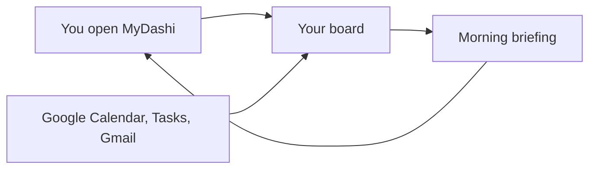
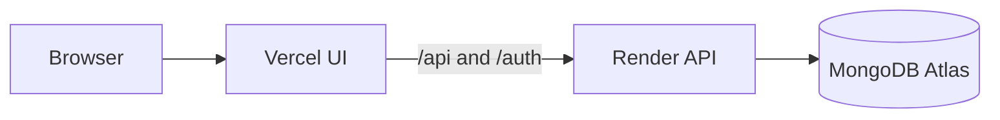

# MyDashi

**Your day, at a glance.** Calendar, tasks, and mail, folded into one morning board you can rearrange, hide, and talk to.

Sign in with Google, answer three short questions, and MyDashi lays out a board that matches how you start the day. A briefing lands at the hour you pick. English and Hebrew are both first-class, including right-to-left layout.

Open a section when you need it. The rest of the page can stay folded.

## Contents

- [What you get](#what-you-get)
- [A morning, end to end](#a-morning-end-to-end)
- [Run it locally](#run-it-locally)
- [Google Cloud](#google-cloud)
- [Optional connections](#optional-connections)
- [Environment reference](#environment-reference)
- [Deploy](#deploy)
- [Layout of the repo](#layout-of-the-repo)
- [What the app is allowed to touch](#what-the-app-is-allowed-to-touch)

## What you get

The board is a grid of cards. Drag them into the order you want, or turn a card off. A short onboarding quiz (studies, software, or general productivity, plus outdoor hobbies and how you like to start the day) picks a first layout. You can change every choice later in Settings.

| Card | What it does | Needs |
| --- | --- | --- |
| Morning briefing | A short read of the day from calendar, tasks, and mail | Google. OpenAI makes the wording richer; a plain fallback still runs without it |
| Tip of the day | One line based on how full the calendar and task list are | Google |
| Day timeline | Meetings, commute, and training on one strip. Add or remove events here | Google Calendar, plus home and work for commute times |
| Tasks | Open Google Tasks. Create, complete, and reopen them | Google Tasks |
| Mail | People who need a reply, unread first | Gmail, read-only |
| Ask my week | Questions about the last seven days, with sources you can open | Google. OpenAI for the answers |
| Deliveries | Order and shipping updates pulled from mail | Gmail |
| Nutrition | Search foods, scan a barcode, track a daily calorie goal | Open Food Facts. No key |
| Outdoor training | When it is a good window to run, ride, or fly | OpenWeather |
| Deadlines | A Notion database you choose after connecting | Notion OAuth |
| Training | Weekly distance from a Notion workouts database, or from Strava | Notion or Strava |
| Currencies | Exchange rates against a home currency, with a short history | Frankfurter (ECB). No key |
| Stocks and funds | USD or NIS tickers, plus price alerts checked in the background | Yahoo Finance. No key |

The header also keeps a weather chip, watchlist alerts, and one-tap Waze links for home and work once those addresses are saved.

<details>
<summary><strong>A few things that are easy to miss</strong></summary>

- The briefing hour is yours. The server only wakes every few minutes and sends the summary when your local hour arrives.
- Manual “refresh the briefing” is rate-limited (about once a minute) so a double-click does not burn an API call.
- Dashboard data from Google is reused for about 90 seconds, so flipping between cards stays quick.
- Price alerts keep checking while the tab is closed, on their own schedule.
- Sounds, light and dark theme, and language all live in the header. Language covers the whole app, briefing included.
- Notion and Strava are per person. Connecting one account never exposes another person’s workspace or activities.

</details>

## A morning, end to end



1. You sign in. Google returns a refresh token, which is encrypted before it is stored.
2. Onboarding asks what you focus on, which outdoor activities matter, and how you like to start the day.
3. The board loads today’s events, open tasks, and mail that looks like it needs you.
4. At your chosen hour, the scheduler writes a briefing in your language.
5. You can ask about the past week, add a task, scan a snack, or drag the cards into a different order.

## Run it locally

You need **Node.js 22**, a **MongoDB** database (Atlas works), and a **Google Cloud OAuth client**. Everything else is optional and only unlocks extra cards.

```bash
git clone <your-repo-url>
cd User-Dashboard
npm install
cp .env.example .env   # Windows: copy .env.example .env
```

Fill in the four values the server refuses to boot without. The commands below print secrets you can paste into `.env`.

```bash
node -e "console.log(require('crypto').randomBytes(32).toString('hex'))"
```

Run that twice: once for `SESSION_SECRET` (any string of at least 32 characters is fine; hex is an easy choice) and once for `ENCRYPTION_KEY`, which must be exactly 64 hex characters. Then set `GOOGLE_CLIENT_ID`, `GOOGLE_CLIENT_SECRET`, and `MONGODB_URI`. See [Google Cloud](#google-cloud) if the OAuth client does not exist yet.

```bash
npm run dev
```

Open [http://localhost:5173](http://localhost:5173). The Vite dev server proxies `/api` and `/auth` to the API on port 3000, so the session cookie stays on one origin.

| Script | What it does |
| --- | --- |
| `npm run dev` | API and UI together, with the API restarting on file changes |
| `npm run dev:backend` | API only, on port 3000 |
| `npm run dev:frontend` | UI only, on port 5173 |
| `npm run build` | Production build of the UI into `frontend/dist` |
| `npm start` | Production API (`node backend/src/server.js`) |

<details>
<summary><strong>Handy one-off scripts</strong></summary>

From the repo root, via the backend workspace:

```bash
npm --workspace backend run summary:run    # generate a briefing now, for testing
npm --workspace backend run check:crypto   # confirm ENCRYPTION_KEY can lock and unlock
npm --workspace backend run migrate:json   # one-time import from the retired JSON store
```

</details>

<details>
<summary><strong>If the UI cannot reach the API on Windows</strong></summary>

The dev proxy talks to `http://127.0.0.1:3000` on purpose. Windows often resolves `localhost` to IPv6 first, and the API is listening on IPv4. Leave the default unless you have a reason to set `VITE_BACKEND_URL`.

</details>

## Google Cloud

Create an OAuth client of type **Web application** in [Google Cloud Console](https://console.cloud.google.com/apis/credentials).

1. Enable **Google Calendar API**, **Google Tasks API**, **Gmail API**, and **People API**.
2. Configure the OAuth consent screen. While the app is in testing, add your own Google account as a test user.
3. Under **Authorized redirect URIs**, add the callback exactly:

```text
http://localhost:3000/auth/google/callback
```

4. Copy the client id and secret into `.env` as `GOOGLE_CLIENT_ID` and `GOOGLE_CLIENT_SECRET`.

The consent screen asks for profile, email, calendar events, tasks, read-only Gmail, and profile addresses (used only to prefill home and work). The app requests a refresh token so the morning job can run while you are signed out.

## Optional connections

Skip any of these. The related card simply stays unavailable until the credentials exist.

<details>
<summary><strong>OpenAI — richer briefings and “Ask my week”</strong></summary>

Set `OPENAI_API_KEY`. The default model is `gpt-4o-mini` (`OPENAI_MODEL`).

Without a key, the morning card still shows a straightforward briefing built from your calendar, tasks, and mail. Questions about the week need the key.

</details>

<details>
<summary><strong>OpenWeather — outdoor training and the header chip</strong></summary>

Create a free key at [OpenWeatherMap](https://openweathermap.org/api). The app uses current weather and the 5-day / 3-hour forecast. One Call 3.0 is unused.

```text
OPENWEATHER_API_KEY=
WEATHER_LAT=          # fallback pin until a user sets their own
WEATHER_LON=
```

Each person can pin their own coordinates in Settings. The two coordinates above keep the header chip filled in before that happens.

</details>

<details>
<summary><strong>Notion — deadlines and workouts</strong></summary>

Create a **public** OAuth integration at [notion.so/my-integrations](https://www.notion.so/my-integrations). An internal integration secret will not work: each person authorizes the integration, then picks their own databases in Settings.

```text
NOTION_CLIENT_ID=
NOTION_CLIENT_SECRET=
NOTION_REDIRECT_URI=http://localhost:3000/auth/notion/callback
```

Add that same redirect URI on the Notion integration. No database ids belong in `.env`.

</details>

<details>
<summary><strong>Strava — training, when Notion workouts are absent</strong></summary>

Leave these blank and the Strava routes stay off. If both Notion workouts and Strava are connected, Notion is the source the training card uses.

```text
STRAVA_CLIENT_ID=
STRAVA_CLIENT_SECRET=
STRAVA_REDIRECT_URI=http://localhost:3000/auth/strava/callback
```

Strava’s activity API requires a paid Strava subscription.

</details>

## Environment reference

Copy [`.env.example`](.env.example) to `.env` at the repo root. A `backend/.env` can override it locally. Never commit either file.

<details>
<summary><strong>Required — the server will not start without these</strong></summary>

| Variable | Purpose |
| --- | --- |
| `GOOGLE_CLIENT_ID` | OAuth client id |
| `GOOGLE_CLIENT_SECRET` | OAuth client secret |
| `GOOGLE_REDIRECT_URI` | Callback. Local default: `http://localhost:3000/auth/google/callback` |
| `SESSION_SECRET` | Signs the session cookie. At least 32 characters |
| `ENCRYPTION_KEY` | 64 hex characters. Encrypts provider refresh tokens in MongoDB. Losing it means everyone must reconnect |
| `MONGODB_URI` | Atlas SRV string or any MongoDB URI |
| `MONGODB_DB_NAME` | Database name. Default `user_dashboard` |

</details>

<details>
<summary><strong>Server, cookies, and new accounts</strong></summary>

| Variable | Default | Purpose |
| --- | --- | --- |
| `PORT` | `3000` | API port |
| `FRONTEND_URL` | `http://localhost:5173` | Where OAuth sends the browser after login. No trailing slash |
| `COOKIE_SECURE` | on in production, or when `FRONTEND_URL` is `https` | Send the session cookie only over HTTPS |
| `TRUST_PROXY` | off | Turn on behind Nginx, Caddy, Render, or Fly so the client IP and HTTPS scheme are real |
| `SUMMARY_LANGUAGE` | `Hebrew` | Starting language for a new account |
| `TIMEZONE` | the host zone | Starting timezone for a new account, for example `Asia/Jerusalem` |
| `SUMMARY_HOUR` | `7` | Starting local hour for the briefing |
| `ACTIVITY_WEEKLY_GOAL_KM` | `0` | Weekly distance target. `0` means report totals only |
| `SUMMARY_CRON` | `*/15 * * * *` | How often the scheduler looks for people whose delivery hour has arrived |
| `WATCHLIST_CRON` | `*/5 * * * *` | How often saved price alerts are checked |
| `DASHBOARD_CACHE_TTL_SECONDS` | `90` | How long Google results are reused |
| `SUMMARY_MIN_REFRESH_SECONDS` | `60` | Minimum gap between manual briefing refreshes |
| `HEALTH_DETAIL` | off | `true` adds cron and model info to `GET /health` |

</details>

## Deploy

The UI is a static Vite app. The API is a single Node process that also runs the briefing and watchlist jobs. Keep **one** API instance so those jobs do not fire twice.



The browser only talks to the Vercel domain. Vercel proxies `/api` and `/auth` to Render, so the session cookie stays on that domain. OAuth callbacks must be the Vercel URLs.

<details>
<summary><strong>1. MongoDB Atlas</strong></summary>

Create a database user and a connection string. Under Network Access, allow the API host (or `0.0.0.0/0` while you are setting things up). Put the string in `MONGODB_URI`.

</details>

<details>
<summary><strong>2. API on Render</strong></summary>

[`render.yaml`](render.yaml) is a Blueprint for a free web service in Frankfurt, Node 22, health check at `/health`.

In the Render dashboard: **New → Blueprint**, point it at this repo, and fill the secrets it prompts for (`sync: false` values are never stored in git).

Set these to your Vercel origin, with no trailing slash:

```text
FRONTEND_URL=https://<project>.vercel.app
GOOGLE_REDIRECT_URI=https://<project>.vercel.app/auth/google/callback
NOTION_REDIRECT_URI=https://<project>.vercel.app/auth/notion/callback
STRAVA_REDIRECT_URI=https://<project>.vercel.app/auth/strava/callback
```

`TRUST_PROXY` is already `true` in the blueprint, because Render terminates TLS.

A free Render instance sleeps after about 15 minutes of quiet, and the next request takes about a minute to wake. `node-cron` only runs while the process is awake. A ping of `/health` every 10 minutes from an outside monitor keeps the morning job on schedule. One service fits in the monthly free hours.

</details>

<details>
<summary><strong>3. UI on Vercel</strong></summary>

[`vercel.json`](vercel.json) builds the frontend and rewrites `/api/*` and `/auth/*` to the API. On the Vercel project, set:

```text
VITE_BACKEND_URL=https://<service>.onrender.com
```

No trailing slash. Register the same Google (and Notion / Strava) callback URLs in each provider’s console. They must match the Vercel origin, because that is the address the browser uses.

</details>

`GET /health` returns `{ "ok": true }`. With `HEALTH_DETAIL=true` it also reports the timezone, whether OpenAI is configured, and the cron schedules.

## Layout of the repo

```text
User-Dashboard/
├── frontend/          React 19, Vite, Tailwind 4
│   └── src/
│       ├── components/   cards, onboarding, settings UI
│       ├── lib/          i18n (en, he), widget layout, API client
│       └── pages/        settings
├── backend/
│   └── src/
│       ├── routes/       /auth and /api
│       ├── google/       Calendar, Gmail, Tasks, People
│       ├── integrations/ weather, Notion, Strava, FX, quotes, food, Waze
│       ├── ai/           briefing, week questions, nutrition help
│       ├── jobs/         morning summary and watchlist alerts
│       └── store/        MongoDB models
├── .env.example
├── render.yaml          Render blueprint for the API
└── vercel.json          Vercel build and /api + /auth proxy
```

Widget ids are shared on purpose. `backend/src/lib/widgets.js` is the catalog; `frontend/src/lib/widgets.js` is how those ids are drawn. Add a card in both places.

## What the app is allowed to touch

- **Gmail is read-only.** Mail is used for the morning list, delivery tracking, and week questions. The app does not send, delete, or label messages.
- **Calendar events** can be read, created, updated, and deleted from the timeline.
- **Google Tasks** can be read, created, completed, and reopened.
- **Profile addresses** are read once to prefill home and work when those fields are empty. Google Maps saved places are not available to the app.
- Refresh tokens are encrypted with `ENCRYPTION_KEY` before they are written to MongoDB. Disconnecting a provider deletes that token. Signing out clears the session cookie.
- Each integration is optional and per account. Disconnecting Notion leaves Google and Strava in place.

If you rotate `ENCRYPTION_KEY`, stored tokens can no longer be read. People sign in again, and the new key takes over from there.
